# JobMatch AI (BidExtension fork)

**Smart Chrome Extension for Job Seekers** — Analyze any job posting against your resume, get a match score and skill gap analysis, auto-fill applications, generate cover letters (with `.docx` / `.pdf` export), rewrite and tailor resume bullets, and track every job you apply to — including an optional sync of applied jobs to a Google Sheet.

This is a personal fork of [wadekarg/JobMatchAI](https://github.com/wadekarg/JobMatchAI), maintained at [acebrown815/BidExtension](https://github.com/acebrown815/BidExtension). It is **not** the version published on the Chrome Web Store — see [Installation](#installation-developer--local-build) below to load it unpacked. Key differences from the upstream project are called out throughout this document and summarized in [What's Different From Upstream](#whats-different-from-upstream).


<p align="center">
  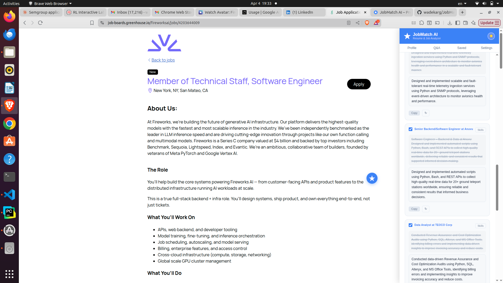
</p>
<p align="center"><em>JobMatch AI panel open on a job posting — resume switcher, one-click Analyze, AutoFill, Cover Letter, Improve Resume Bullets, and more.</em></p>

---

## Features

### Job Match Score & Skill Analysis

Upload your resume once. Navigate to any job posting, open the panel, and click **Analyze Job** to get a full breakdown in seconds.

<p align="center">
  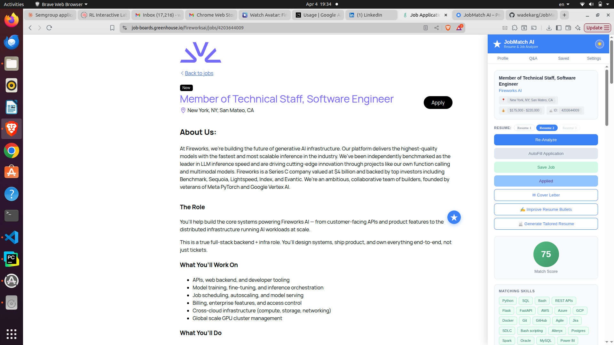
</p>
<p align="center"><em>Analysis results — match score with color indicator, matching skills you already have, missing skills to address, and action buttons for every next step.</em></p>

- **Match Score (0–100)** — color-coded indicator so you can tell at a glance whether a role is worth pursuing
- **Matching Skills** — skills from your resume that the job requires
- **Missing Skills** — gaps between your profile and the job description
- **Insights** — a written strengths and gaps summary: what makes you a strong candidate and what to address before applying
- **ATS Keywords** — key terms the applicant tracking system is scanning for
- **Recommendations** — specific, actionable advice to improve your fit for that exact role

Results are cached per URL. You get a consistent score every session — click **Re-Analyze** any time to force a fresh evaluation.

---

### Recommendations & ATS Keywords

<p align="center">
  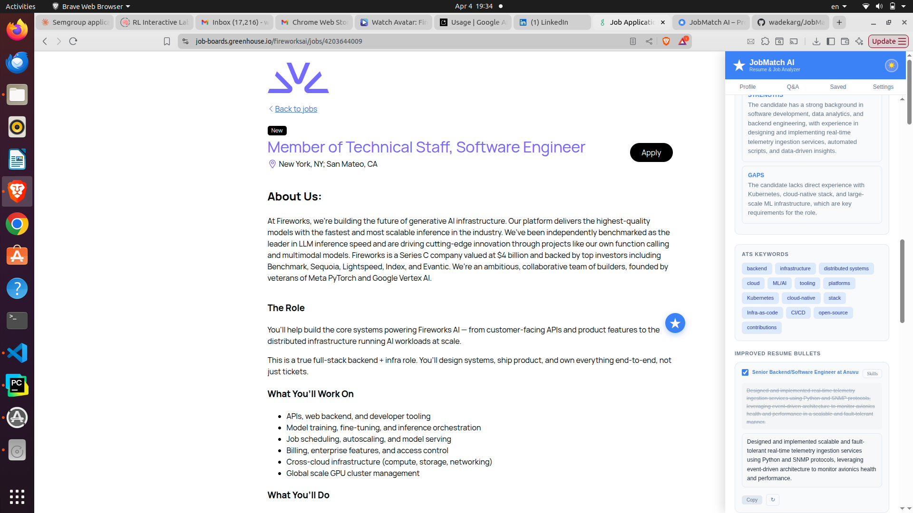
</p>
<p align="center"><em>Recommendations with specific advice on how to strengthen your application, followed by the ATS keyword chips to incorporate into your resume and cover letter.</em></p>

---

### Smart Auto-Fill

Click **AutoFill Application** and the extension scans every field on the page, sends them to the AI along with your resume profile and pre-saved Q&A answers, and prepares an answer for every field.

A **Review before fill** panel then appears in the side panel listing every proposed answer with a checkbox. Uncheck anything you don't want filled, then click **Apply Selected** to commit — or **Cancel** to discard. Nothing is written to the form until you click Apply.

<p align="center">
  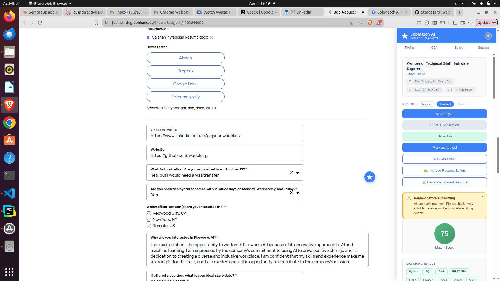
</p>
<p align="center"><em>AutoFill in action — form fields completed using your resume and saved Q&A answers. Teal "✦ Autofilled by JobMatch AI" badges mark every filled field after you confirm.</em></p>

Works with:
- Standard text inputs and textareas
- Native `<select>` dropdowns
- Custom dropdowns built with React, Angular, or plain JS
- Radio buttons and checkboxes

Sensitive fields (CSRF tokens, tracking IDs, reCAPTCHA, framework internals) are filtered out automatically — they're never sent to the AI and never written to.

Always review filled fields one more time before submitting.

---

### Cover Letter Generator

After analyzing a job, click **Cover Letter** in the panel. A tailored letter is generated from the job description and your resume — written specifically for that role and your background, not a generic template.

Export the finished letter as **`.docx`** or **`.pdf`** with one click, complete with your name, contact details, and a clean letterhead. Edit it inline in the panel before exporting, or click ↻ to regenerate.

<p align="center">
  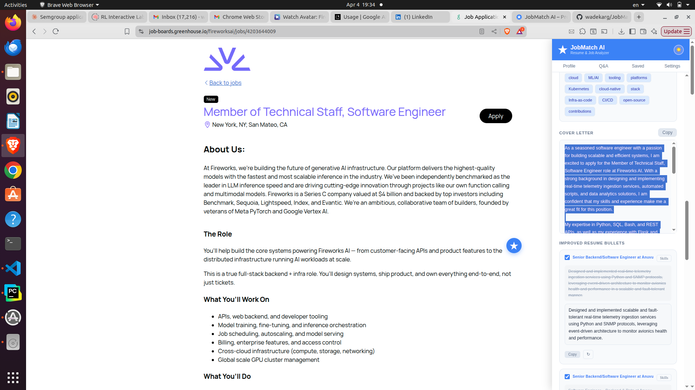
</p>
<p align="center"><em>Cover letter generated from your resume and the job description — copy it straight from the panel. Resume bullet cards are visible below for the next step.</em></p>

---

### Resume Bullet Rewriter & Tailored Resume

Click **Improve Resume Bullets** after analyzing a job. The AI rewrites every bullet in your experience section to match the job's language and incorporate the missing skills from your analysis.

<p align="center">
  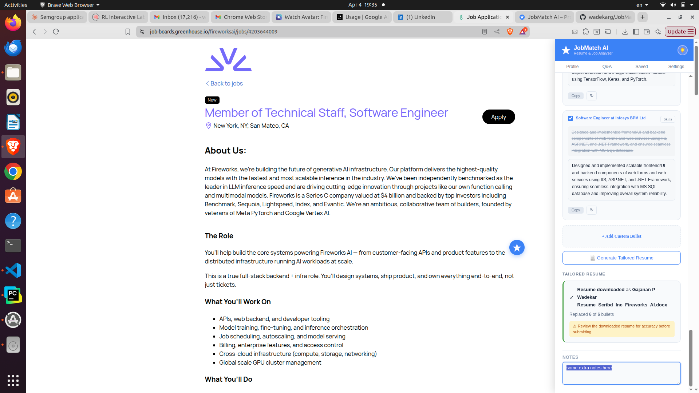
</p>
<p align="center"><em>Bullet rewriter with improved bullets, Add a Bullet area, and the Generate Tailored Resume button. The downloaded file name is shown once the DOCX is ready.</em></p>

Each bullet card gives you full control before generating:

- **Edit the improved text directly** — the rewritten bullet is a live editable field. Whatever you type is what goes into the tailored resume.
- **Skills panel** — click the **Skills** button on any bullet to see which missing skills are being woven in. Click individual skill chips to exclude skills you don't want added to that bullet.
- **Regenerate (↻)** — rewrites just that one bullet using only the skills currently selected for it. Regenerate as many times as you like.
- **Include / exclude toggle** — uncheck a bullet to exclude it from the tailored resume. Excluded bullets are faded with strikethrough so you can see exactly what's in and out.
- **Add a custom bullet** — write a new bullet from scratch at the bottom of the list and assign it to a specific experience section. It will be inserted into the tailored resume alongside the rewritten ones.

**Generate Tailored Resume** — once you're satisfied, click the button. The extension:

1. Takes every **checked** bullet — rewritten and custom
2. Replaces the original text in your uploaded DOCX with the improved / edited version
3. Inserts custom bullets into their target experience sections
4. Adds the job's **missing skills** to the skills section of your resume
5. Downloads the result as **`{your_resume_name}_{company}.docx`**

Your original resume file is never modified. The tailored version is always a new download.

---

### Job Notes

Every job has a **Notes** section at the bottom of the panel — a free-text area for observations, interview prep, follow-up reminders, or anything else. Notes save automatically per URL and persist across sessions.

<p align="center">
  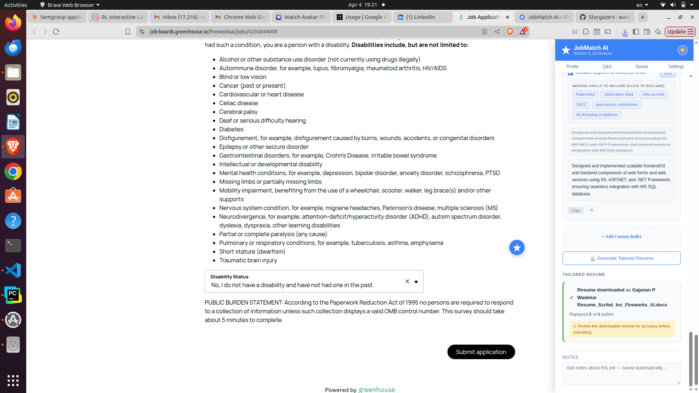
</p>
<p align="center"><em>Notes section — auto-saved per job URL. Visible at the bottom of the panel on every job page you've visited.</em></p>

---

### Unlimited Resume Profiles & Local Auto-Match

Store as many resume profiles as you want and switch between them with one click directly from the panel — add a new one with the **+** button, or delete one you no longer need. Each resume is independently parsed and stored. Rename any resume to keep them organized — for example, "Backend Eng", "Data Eng", "Lead".

<p align="center">
  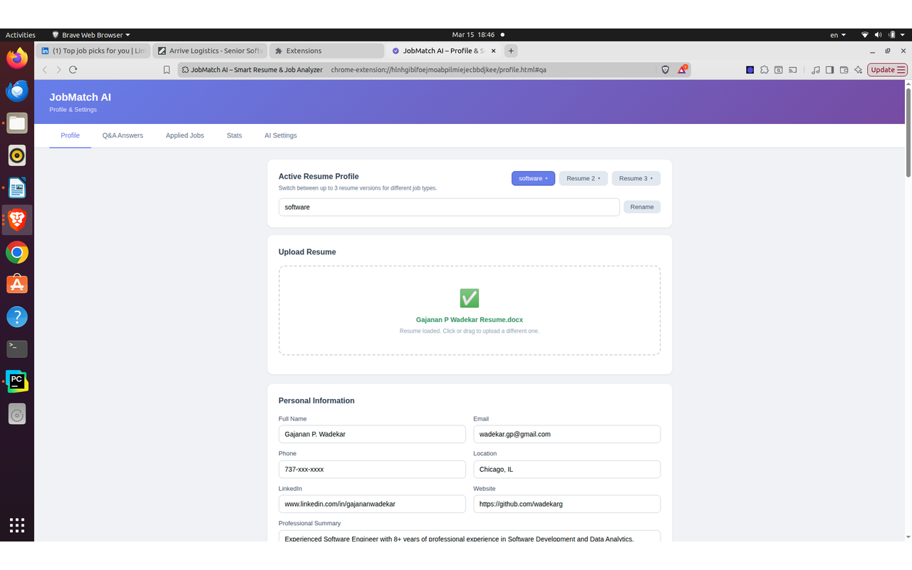
</p>
<p align="center"><em>Profile page — named resumes with add/delete controls, drag-and-drop upload (PDF or DOCX), and fully parsed profile fields including contact info, summary, skills, experience, education, projects, and certifications. Autosaves as you edit.</em></p>

With two or more resumes saved, the extension scores every resume against the current job posting locally — by ATS-keyword overlap across skills, certifications, and project technologies — with **no AI call and no network request**. Whichever resume scores highest is auto-selected as the active one before you even click Analyze (a **"★ ... Switch?"** hint and a Local Match badge show the score); picking a resume yourself for that job overrides the auto-selection until you open a different posting. The Profile tab's **ATS Keywords by Resume** card lists the exact terms each resume contributes to this matching.

---

### Backup & Restore

**Settings → Backup & Restore** exports your entire setup — profile, resumes, Q&A answers, saved and applied jobs, AI Settings, and Google Sheets sync config — as a single JSON file, and imports it back on another browser or machine. The exported file includes your API key and Sheets sync secret in plain text, so keep it private and only import files you trust.

---

### Common Q&A Answers

Pre-fill answers to hundreds of standard application questions so AutoFill can complete them instantly. Covers work authorization, availability, salary expectations, notice period, sponsorship requirements, EEO and demographic fields, and more. Filter by category to quickly find and update any answer.

**Export / Import** — export your Q&A answers as a JSON file and import it on another browser or computer instead of retyping everything. Importing updates any question that already matches by text and adds the rest; it never removes questions the imported file doesn't mention.

<p align="center">
  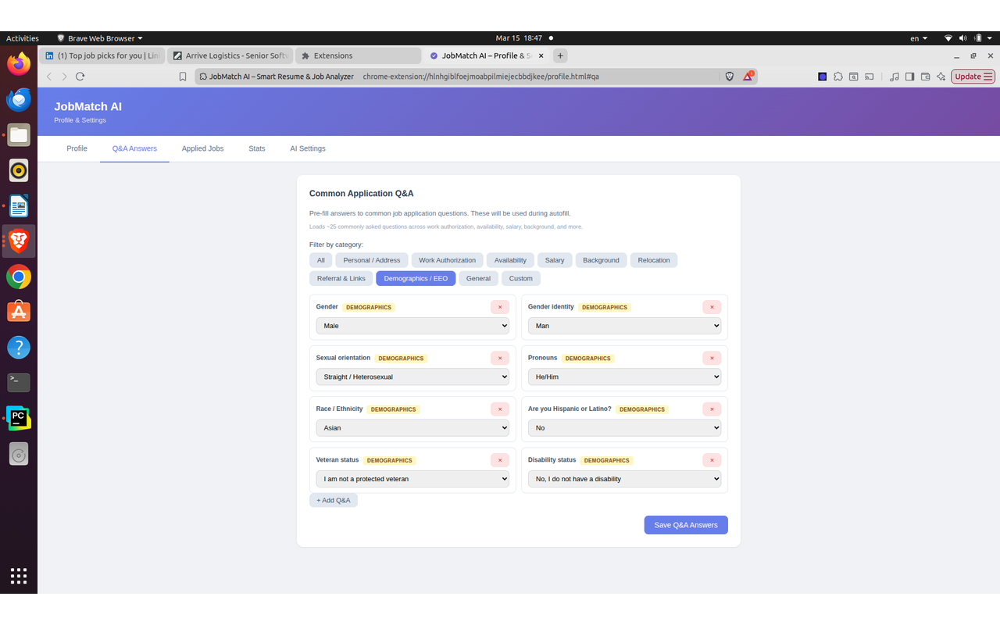
</p>
<p align="center"><em>Q&A Answers — pre-configured responses with category filtering. Click "Load Common US Job Application Questions" to populate everything at once.</em></p>

---

### Applied Tracking & Google Sheets Sync

Click **Mark as Applied** on any analyzed job and it's recorded locally with its match score, title, company, location, salary, and date — this count feeds the Stats tab's "Total Applied" figure. There is no standalone in-panel "Applied Jobs" table in this fork; instead, applied jobs can be pushed automatically to a Google Sheet:

- **Settings → Google Sheets Sync** — paste the Web App URL from a one-time [Apps Script deployment](docs/sheets-sync/SETUP.md) (`docs/sheets-sync/Code.gs`), set a shared secret, and enable sync. No Google API key is involved — Sheets doesn't support write access with a bare key, so the extension POSTs to a script running under your own Google account instead.
- Every **Mark as Applied** click appends a row — Date, Title, Link, Company, Location, Salary, ResumeNo, Score — to your target tab (or "Applications" by default). The button only flips to the locked "Applied" state once the row is confirmed appended; if sync fails or isn't configured, it stays as "Mark as Applied" so you can retry without creating a duplicate record.
- **Test Sync** in Settings verifies connectivity and your shared secret without adding a row.

See `docs/sheets-sync/SETUP.md` for full setup and troubleshooting steps.

---

### Job Search Stats

The Stats tab gives you a live overview of your search: total jobs analyzed, total applied, average match score, score distribution, and a ranked list of the skills appearing most often in jobs where you had gaps — so you know exactly what to add to your resume next.

<p align="center">
  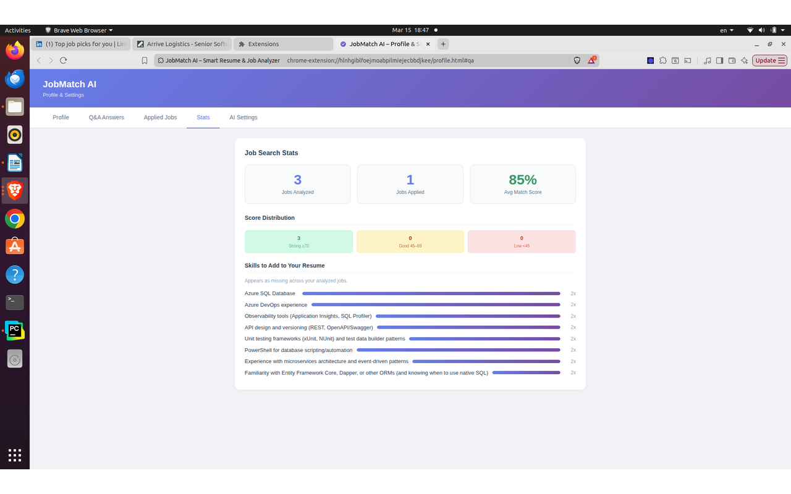
</p>
<p align="center"><em>Stats — job search analytics at a glance, including the top skills to add to your resume based on all the jobs you've analyzed.</em></p>

---

### Saved Jobs

Bookmark any job from the panel — including before you've run Analyze. The **Saved Jobs** tab lists every bookmarked job in a table with score badge (or a neutral "Not analyzed" badge for quick-saves with no score yet), title linked back to the posting, company, location, salary, date, and a Delete button.

---

### Draggable Floating Button

The **★ button** that opens the panel can be dragged anywhere on the screen. Its position is saved and restored across page navigations — it stays where you put it.

---

### Three Themes

Switch between **Ocean Blue** (light), **Dark Mode**, and **Warm Amber** using the theme toggle (☀️ 🌙 🌻) in the panel header or profile page. Your preference is saved automatically.

---

## Where It Works

JobMatch AI works on any website with a job posting. It has dedicated extraction and auto-fill support for the most widely used platforms:

| Site | JD Extraction | Salary | Location | Auto-Fill |
|------|:---:|:---:|:---:|:---:|
| LinkedIn | ✓ | ✓ | ✓ | ✓ |
| Indeed | ✓ | ✓ | ✓ | ✓ |
| Glassdoor | ✓ | ✓ | ✓ | ✓ |
| Greenhouse | ✓ | ✓ | ✓ | ✓ |
| Lever | ✓ | ✓ | ✓ | ✓ |
| Workday | ✓ | ✓ | ✓ | ✓ |
| Any other site | ✓* | ✓* | ✓* | ✓ |

\* *Uses universal selectors and regex fallbacks on sites without dedicated support.*

On SPAs like LinkedIn and Indeed, the extension detects navigation between job postings and resets the panel state automatically — no page reload needed.

---

## AI Provider — Your Key, Your Data

JobMatch AI uses your own OpenAI API key and calls the OpenAI Chat Completions API directly from the browser. Nothing passes through any external server (other than the optional Google Sheets sync webhook, see above). Your resume, your answers, and your API key are stored locally in Chrome's storage.

<p align="center">
  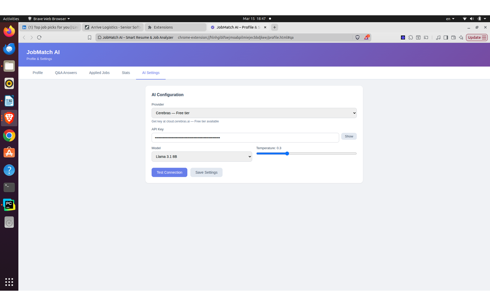
</p>
<p align="center"><em>Settings — paste your OpenAI API key, pick a model, set temperature, and click Test Connection to verify before saving.</em></p>

This fork supports a **single provider, OpenAI**, unlike upstream JobMatch AI's ten-provider lineup (Anthropic, Google Gemini, Groq, Cerebras, Together AI, OpenRouter, Mistral AI, DeepSeek, Cohere, OpenAI). The provider abstraction (`aiService.js`) is kept generic internally, so another provider could be re-added the same way if needed, but only OpenAI ships today.

Get a key at [platform.openai.com/api-keys](https://platform.openai.com/api-keys). Built-in models include GPT-4.1, GPT-4.1 Mini, GPT-4o, GPT-4o Mini, o4-mini, and o3-mini (default: GPT-4.1).

### Live Model Refresh & Custom Models

- **🔄 Refresh models** — click the refresh button next to the model dropdown and the extension pulls OpenAI's **current** model list directly from the `/models` API. No more being stuck on a deprecated model id.
- **Custom model entry** — pick `Custom…` to paste in any OpenAI model id, including brand-new ones.
- **Saved key** — JobMatch AI remembers your API key locally. A "Clear saved keys" link in Settings wipes it.

---

## Getting Started

### 1. Install and Open

Load the extension unpacked (see [Installation](#installation-developer--local-build) below — this fork isn't published to the Chrome Web Store), then click the toolbar icon or the **★ floating button** on any job page to open the panel.

### 2. Configure AI

Go to **Settings**, paste your OpenAI API key, pick a model, and click **Test Connection**. Click **Save Settings**.

### 3. Upload Your Resume

Go to **Profile**, select or add a resume, and drag & drop your PDF or DOCX. The AI parses it into a structured profile — name, contact info, summary, skills, experience, education, projects, and certifications — all editable. The profile autosaves as you type.

### 4. Pre-fill Q&A (Optional but Recommended)

Go to **Q&A Answers** and click **Load Common US Job Application Questions** to populate standard answers for work authorization, salary, availability, EEO fields, and more. Edit any answer to match your preferences, or import a previously exported Q&A file.

### 5. Analyze a Job

Navigate to any job posting, click the **★ button** to open the panel, and click **Analyze Job**. With two or more resumes saved, the best local ATS-keyword match is auto-selected first. Your match score, insights, skill gaps, ATS keywords, and recommendations are ready in seconds.

### 6. Apply

- Use **AutoFill Application** to complete the form with your resume and Q&A answers
- Generate a **Cover Letter** tailored to the role
- **Improve Resume Bullets** and download a **Tailored Resume** with missing skills added
- Click **Mark as Applied** to log the application (and sync it to Google Sheets, if configured)

### 7. Sync to Google Sheets (Optional)

Go to **Settings → Google Sheets Sync**, follow `docs/sheets-sync/SETUP.md` to deploy the included Apps Script once, then paste the Web App URL and your shared secret and enable sync.

---

## Privacy

- Your resume, API key, and Sheets sync secret are stored **locally** in Chrome's storage — never sent to any server other than OpenAI, and (if you enable it) the Google Apps Script web app you deploy yourself for Sheets sync.
- All AI analysis happens via direct API calls from your browser to OpenAI.
- No analytics, no tracking, no data collection of any kind.

This fork removes upstream JobMatch AI's H1B/PERM sponsorship-data feature, which called a separate third-party H1B data worker — see [What's Different From Upstream](#whats-different-from-upstream). Upstream's privacy policy (linked from the original project) does not describe this fork's Google Sheets sync feature or its narrower AI-provider surface.

---

## Installation (Developer / Local Build)

1. Clone the repository:
   ```bash
   git clone https://github.com/acebrown815/BidExtension.git
   ```
2. Open Chrome and go to `chrome://extensions`
3. Enable **Developer mode** (toggle in the top-right)
4. Click **Load unpacked** and select the `BidExtension` folder
5. Pin the extension from the puzzle icon in the Chrome toolbar

Run the test suite with `npm test` (or `npm run test:watch`) — see `tests/`.

---

## Project Structure

```
BidExtension/
├── manifest.json              # Chrome MV3 manifest
├── background.js              # Service worker: message routing, AI calls, caching,
│                               #   Sheets sync, backup/restore
├── content.js                 # Side panel UI, job scraping, autofill, notes, badges,
│                               #   local resume auto-match
├── aiService.js                # AI provider abstraction (OpenAI only; retry logic)
├── deterministicMatcher.js    # Rule-based dropdown matching (no AI)
├── directFill.js               # Low-level field filling helpers
├── profile.html / profile.js  # Profile, Q&A, Saved Jobs, Stats, Settings
├── styles.css                  # Content script base styles
├── lib/                        # Shared helpers, each as a classic script (content
│   │                           #   scripts / profile.html) + an .mjs mirror (tests):
│   ├── urlKey.js(.mjs)          #   per-URL storage key normalization
│   ├── fieldFilter.js            #   filters sensitive fields out of autofill
│   ├── resumeKeywords.js(.mjs)   #   ATS keyword extraction from a resume profile
│   ├── resumeRanker.js(.mjs)     #   local, zero-AI resume-vs-JD scoring
│   ├── aiSettingsMigration.mjs   #   migrates older stored AI settings shapes
│   ├── coverLetterDocx.mjs, coverLetterPdf.mjs, coverLetterFilename.mjs, docxBullets.mjs
│   │                             #   cover letter / tailored resume file generation
│   └── visaPhrases.js(.mjs), h1bCache.mjs
│                                 #   unused leftovers from the upstream H1B/visa
│                                 #   feature, which this fork doesn't load or call
├── libs/                       # pdf.js, mammoth.js, jspdf, jszip — third-party
│                               #   libraries for client-side resume/file parsing
├── docs/sheets-sync/           # Code.gs (Apps Script) + SETUP.md for Google Sheets sync
├── docs/smoke-test.md          # Manual QA checklist
├── tests/                      # Vitest unit tests (see package.json's "test" script)
├── icons/                      # Extension icons (16, 48, 128px)
└── screenshots/                # README images
```

---

## What's Different From Upstream

Compared to [wadekarg/JobMatchAI](https://github.com/wadekarg/JobMatchAI), this fork:

- **Removed** the Visa & H1B/PERM sponsorship-data feature entirely (sponsorship phrase detection, USCIS/DOL trend charts, H1B history) — `lib/visaPhrases.js` and the H1B data-worker host permission are gone from the manifest, though the unused source files are still present in `lib/`.
- **Reduced AI providers from ten to one** — only OpenAI is wired up in `aiService.js` and the Settings provider dropdown; the multi-provider registry and per-provider key memory were removed.
- **Removed the resume cap** — resumes are an unlimited, add/delete list instead of exactly 3 fixed slots.
- **Added local, zero-AI resume-to-job matching** — auto-selects the best-matching saved resume for the current posting by ATS-keyword overlap (`lib/resumeRanker.js`, `lib/resumeKeywords.js`), and shows an "ATS Keywords by Resume" breakdown on the Profile tab.
- **Added Google Sheets Sync** — optionally pushes every "Mark as Applied" to a Google Sheet via a self-deployed Apps Script webhook (`docs/sheets-sync/`).
- **Removed the in-panel Applied Jobs table** — applied jobs are still tracked (for the Stats count and Sheets sync) but no longer have a dedicated browsable tab; the **Applied Jobs** tab was replaced by a **Saved Jobs** tab with a fuller table (score, title, company, location, salary, date, delete).
- **Added Backup & Restore** and **Q&A Export/Import** — full-setup and Q&A-only JSON export/import from the Settings and Q&A tabs, respectively.
- **Renamed** the "AI Settings" tab to **Settings** (it now also hosts Google Sheets Sync and Backup & Restore).

---

## Contributing

Contributions are welcome.

1. Fork the repo
2. Create a feature branch: `git checkout -b feature/my-improvement`
3. Commit your changes and open a Pull Request

Have an idea but not sure where to start? Open an [issue](https://github.com/acebrown815/BidExtension/issues).

---

## License

MIT
